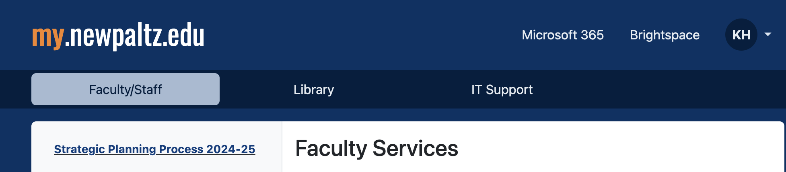

# How-To Access Course in Brightspace

1. Go to https://my.newpaltz.edu/

2. Click on "Brightspace" in top right corner next to your initials.

3. Look for current semester under My Courses. Click on course. If you don't see your course by the second week of classes, reach out to the [graduate coordinator](mailto:hoffmank4@newpaltz.edu).

