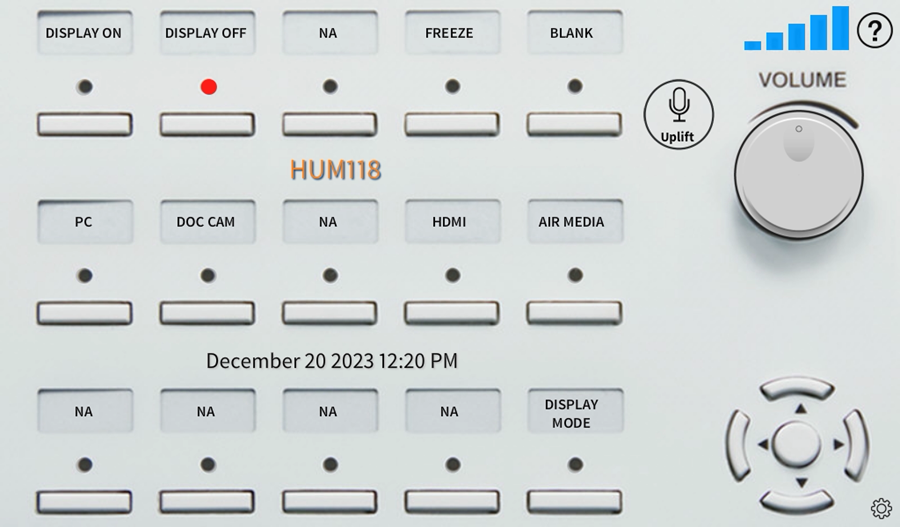

# How-To Use The Projector in Lab

## Using the School Computer

1. If using the attached school computer, first, log into the computer at the front of the room using your SUNY New Paltz username (**do not** include @newpaltz.edu) and password. If you are using your own computer, jump to [Using Your Own Computer](#using-your-own-computer).

2. Depending on the classroom, there will either be a small tablet-like screen, or a black device with similar buttons shown below next to the computer. If there is a screen, tap the screen to wake it up. Click on **Display On***.

3. Click on ***PC*** to project what is on the school computer.
## Using Your Own Computer

1. If using your own computer, you can connect using  an HDMI cord, AirPlay or Crestron AirMedia. Not all projector systems have AirPlay or Crestron AirMedia. Double check what the lab/classroom you are assigned to has available. Having an HDMI cord is a good idea to have with you if you are planning to use your own computer due to the unpredictability with each projector system.

2. To display an image from an HDMI source:
	- Connect your equipment using an HDMI cable that you provide to the HDMI port on the front of the instructor station or desktop.
	- Press the **HDMI** button on the control panel

3. To wirelessly display a personal device through Crestron AirMedia:
	- Press the **AIR MEDIA** button on the control panel
	- Please read **[How To Use Crestron AirMedia](https://newpaltz.teamdynamix.com/TDClient/KB/ArticleDet?ID=32528)**

## Other features

- Press the **FREEZE** button to freeze the image on the Projector
- Press the **BLANK** button to temporary blank the image on the Projector
- Press the up directional button to raise the projector screen
- Press the down directional button to lower the projector screen
- Press the center directional button to stop the projector screen
- Use the volume knob to control audio levels in the room
---
See [Technical Help](/2%20Tools%20and%20Access/Technical%20Help.md) if you run into any issues. 